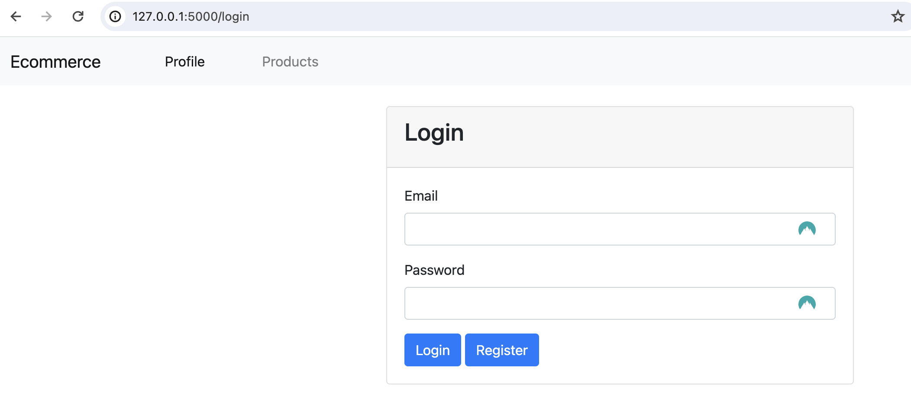
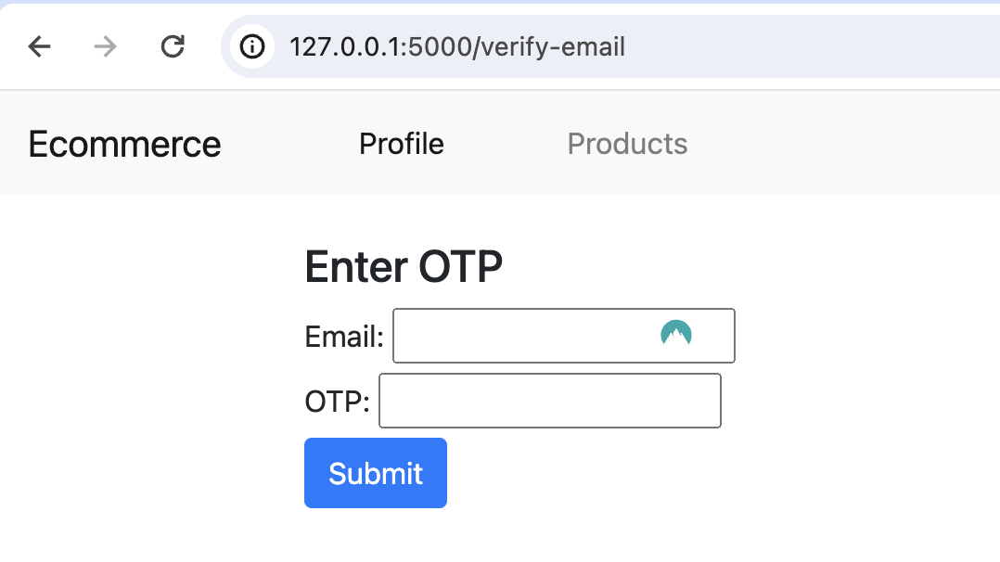
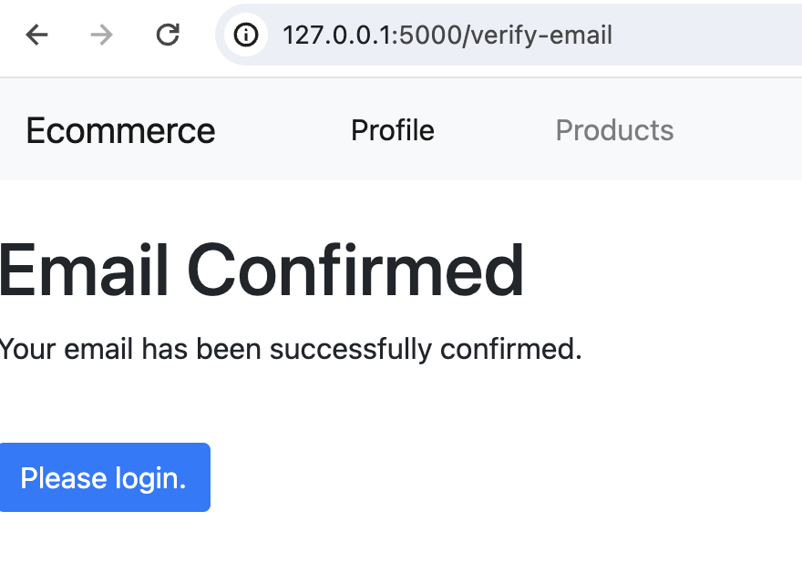
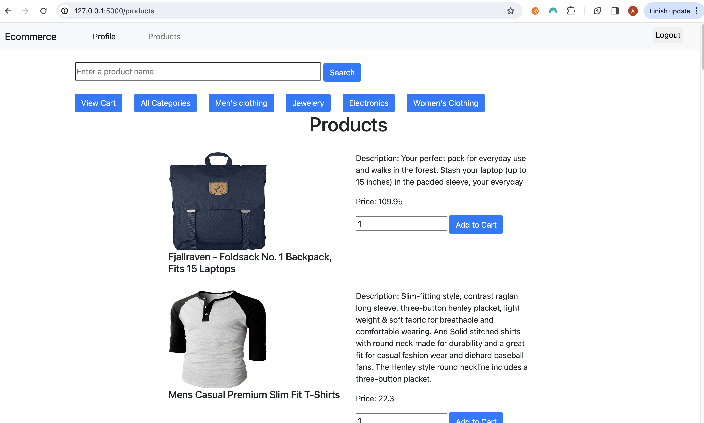
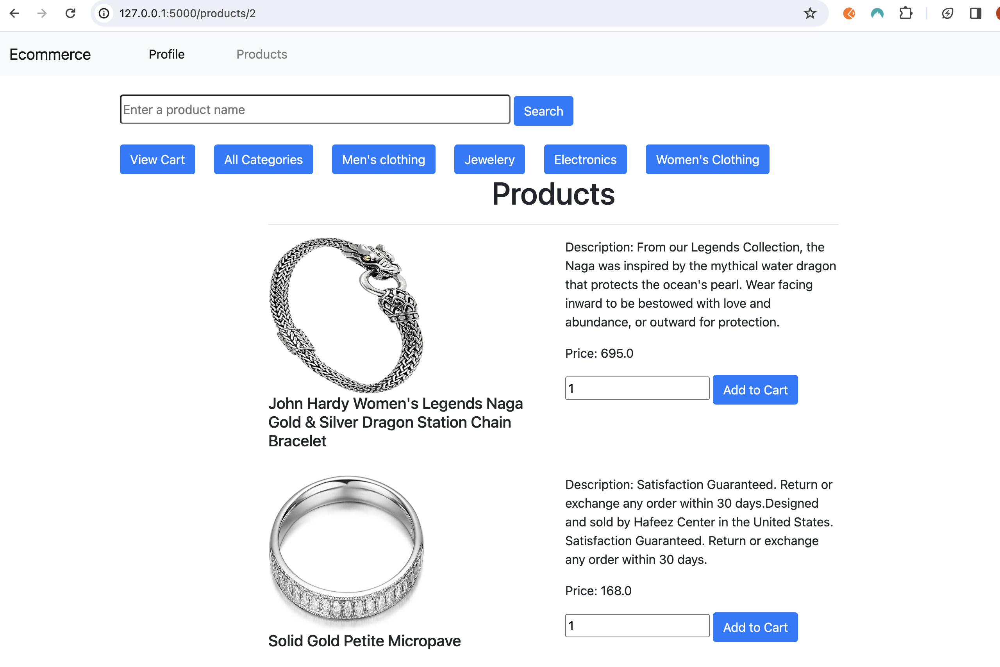
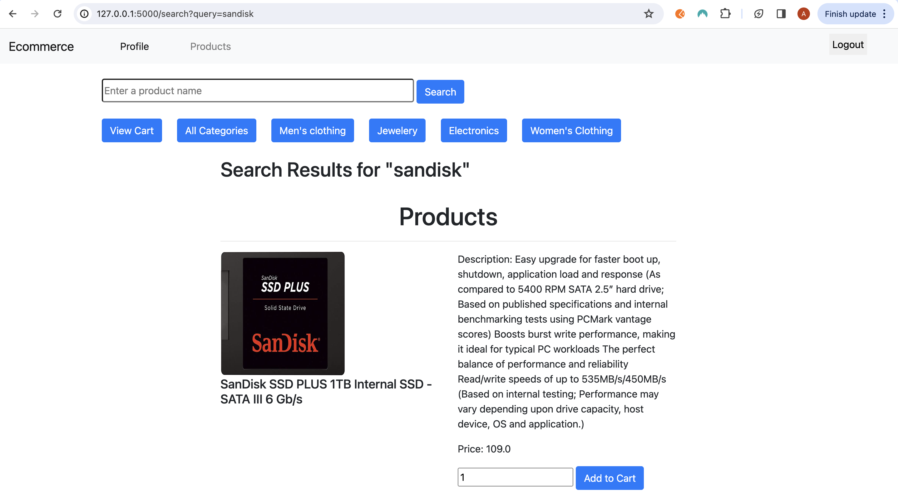
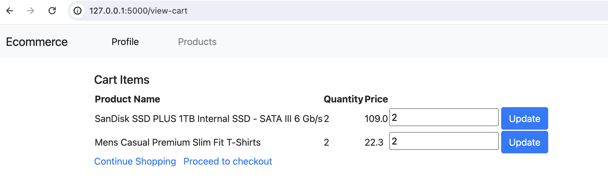
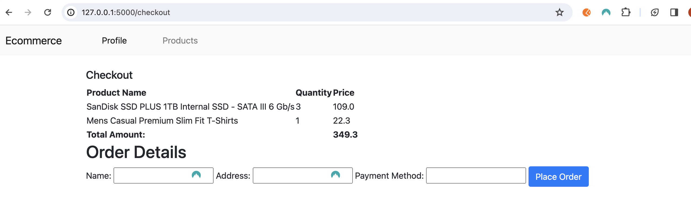

## Create virtualenv

- python3 -m venv myvenv
- source myvenv/bin/activate

## Install Dependencies

- pip3 install -r requirements.txt

## Setup Database

- export FLASK_APP=app

- flask shell

- from app import db

- from models import User

- db.create_all()

- User.query.all() // returns []```

## Run App

- python3 app.py

## Run Selenium Tests:

- pytest -v

## To run in development mode:

- flask run --reload

## On user registration, run the following commands to get the otp

- flask shell

- from models import User

- User.query.all()[-1].otp


## Web App Screenshots


# Login



# Register


# Enter OTP




# Email Confirmed



# Products Dashboard



# Filter Products View By Categories



# Search Products



# View Cart Items



# Checkout


